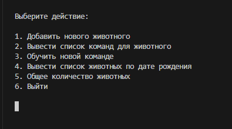

# Система учёта животных в питомнике (Java)

## Информация о проекте

Даннное приложение имитирует систему учёта животных в питомнике. Интерфейс приложения реализован через консоль терминала текстового редактора.

Меню и функционал приложения показан на изображении ниже:



## Иструкции по установке и запуску приложения

Необходимо установить сборку Java Standard Edition
([Ссылка для скачивания сборки](https://developers.redhat.com/products/openjdk "загрузите сборку Red Hat для OpenJDK")) и расширение для Java в VS Code ([Ссылка для скачивания расширения](https://marketplace.visualstudio.com/items?itemName=redhat.java "переход на оф.сайт visual studio")) и другие сопутсвующие расширения, которые предложит VS Code.

Далее:

1. Склонировать репозиторий
```
git clone https://github.com/AnvarMGN/Accounting-system-for-animal-kennel
```
2. Перейти в директорию проекта
```
cd Accounting-system-for-animal-kennel
cd Pet-registry-Java
```
3. Запустить скрипт и действовать в соответствии с инструкциями в меню
```
java main.java
```
